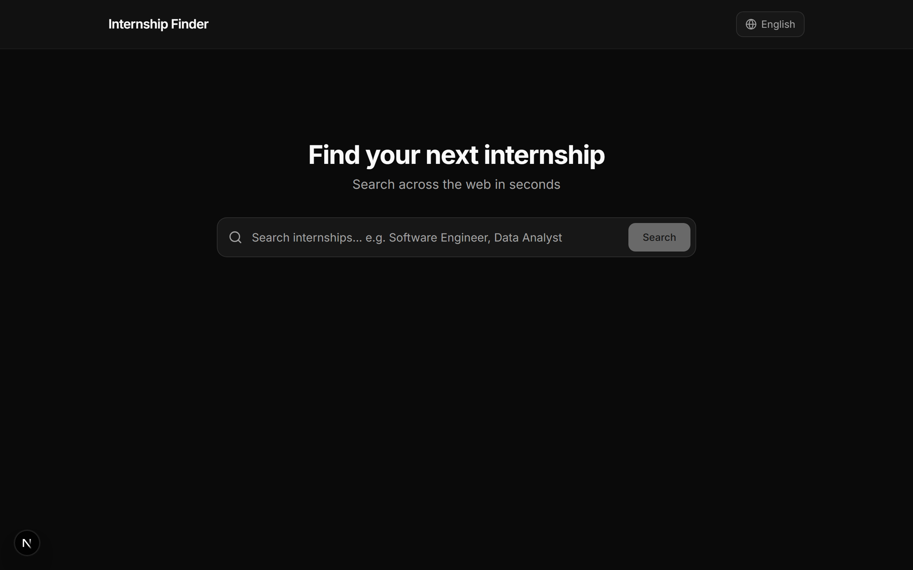
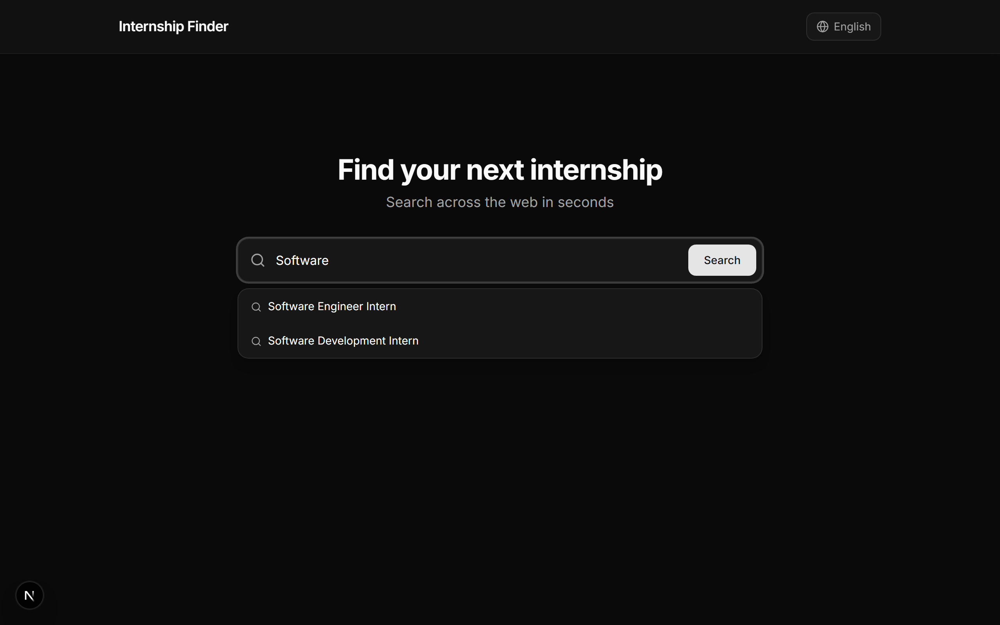
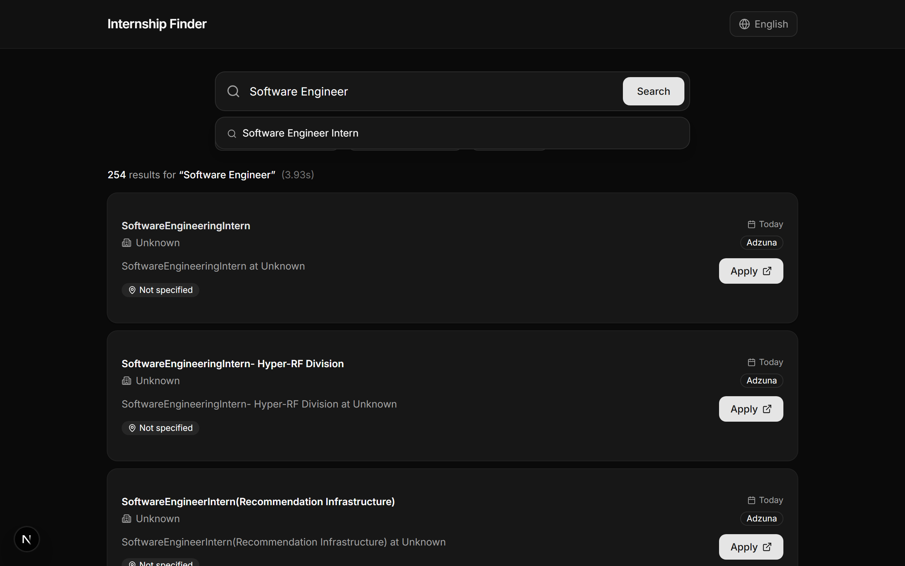
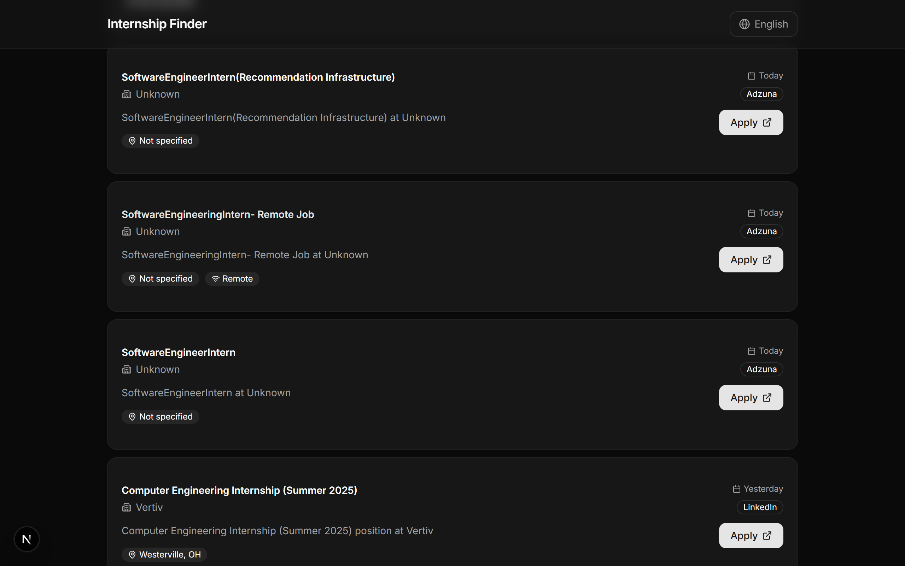
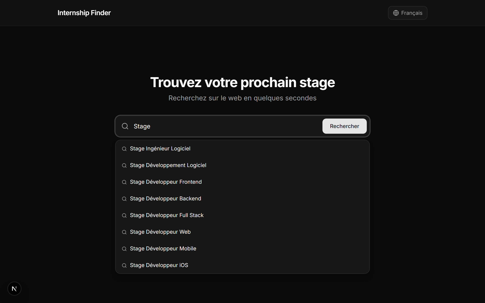
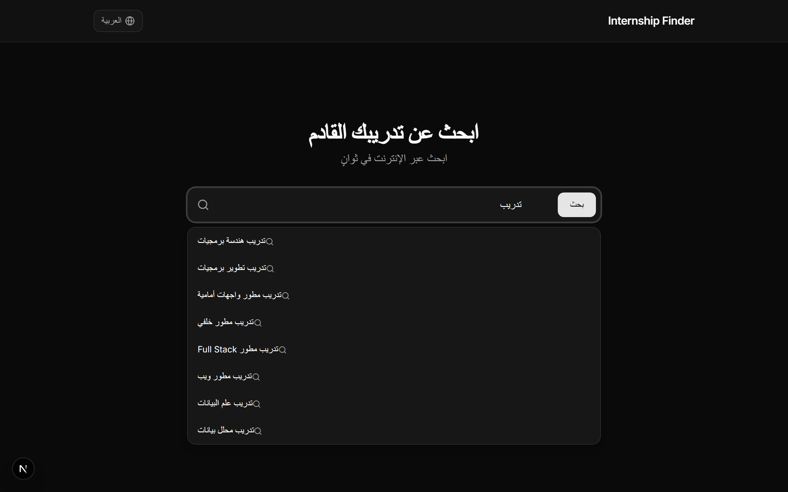

<h1 align="center">Internship Finder</h1>

<p align="center">
  A full-stack internship search tool that scrapes job listings from multiple sources across the web.<br>
  Type a job title, get autocomplete suggestions, hit search, and browse hundreds of real internship listings.
</p>

<p align="center">
  <strong>Next.js 14</strong> &nbsp;·&nbsp; <strong>FastAPI</strong> &nbsp;·&nbsp; <strong>Tailwind CSS</strong>
</p>

<br>

<p align="center">
  
</p>

---

<h2 align="center">Features</h2>

<h3 align="center">Smart Autocomplete</h3>
<p align="center">100+ job titles with instant suggestions as you type, localized to your language.</p>
<p align="center">
  
</p>

<h3 align="center">Multi-Source Scraping</h3>
<p align="center">Searches LinkedIn, Adzuna, TheMuse, RemoteOK, and Arbeitnow concurrently — 100-250+ results per query.</p>
<p align="center">
  
</p>

<h3 align="center">Filters</h3>
<p align="center">Narrow results by location, date posted (24h / 7d / 30d), and remote-only.</p>
<p align="center">
  
</p>

<h3 align="center">8 Languages</h3>
<p align="center">Full UI translation with localized job title suggestions.<br>English, French, Spanish, German, Arabic (RTL), Chinese, Japanese, and Portuguese.</p>

<p align="center">
  
  &nbsp;&nbsp;
  
</p>

---

<h2 align="center">Tech Stack</h2>

| Layer | Tech |
|-------|------|
| Frontend | Next.js 14, React 18, TypeScript, Tailwind CSS, shadcn/ui, Lucide Icons |
| Backend | Python, FastAPI, httpx (async), BeautifulSoup4, Pydantic |
| Scraping | LinkedIn, Adzuna, TheMuse API, RemoteOK API, Arbeitnow API |

---

<h2 align="center">Quick Start</h2>

**Prerequisites** — Node.js 18+ and Python 3.11+

```bash
# Backend
cd backend
pip install -r requirements.txt
uvicorn main:app --reload --port 8001
```

```bash
# Frontend
cd frontend
npm install
npm run dev
```

Open [http://localhost:3000](http://localhost:3000)

---

<h2 align="center">Project Structure</h2>

```
internship/
├── frontend/                  Next.js app
│   ├── src/
│   │   ├── app/
│   │   │   ├── layout.tsx         Root layout (Inter font, dark mode)
│   │   │   ├── page.tsx           Main search page
│   │   │   └── globals.css        Theme variables
│   │   ├── components/
│   │   │   ├── search-bar.tsx     Autocomplete search input
│   │   │   ├── filters.tsx        Location / date / remote filters
│   │   │   ├── internship-card.tsx Result card with apply button
│   │   │   ├── language-switcher.tsx Language dropdown
│   │   │   ├── results-skeleton.tsx Loading skeleton
│   │   │   └── ui/               shadcn/ui primitives
│   │   ├── lib/
│   │   │   ├── api.ts            API client
│   │   │   ├── i18n.ts           Translations (8 languages)
│   │   │   ├── locale-context.tsx React context for i18n
│   │   │   └── utils.ts          Utilities
│   │   └── types/
│   │       └── internship.ts     TypeScript interfaces
│   └── .env.local                API URL config
├── backend/
│   ├── main.py                   FastAPI app, CORS, httpx client
│   ├── config.py                 Settings (Pydantic)
│   ├── routers/
│   │   └── search.py             /api/search + /api/suggestions
│   ├── services/
│   │   ├── scraper.py            Multi-source concurrent scraper
│   │   └── suggestions.py        Multilingual job title dataset
│   ├── models/
│   │   └── response.py           Pydantic schemas
│   └── requirements.txt
└── demo/                         Generated screenshots
```

---

<h2 align="center">API Endpoints</h2>

| Method | Endpoint | Description |
|--------|----------|-------------|
| `GET` | `/api/suggestions?q=soft&locale=en` | Autocomplete job titles |
| `GET` | `/api/search?query=Software+Engineer&location=NYC&remote_only=true&date_filter=7d` | Search internships |
| `GET` | `/health` | Health check |

---

<h2 align="center">How Scraping Works</h2>

All scrapers run concurrently via `asyncio.gather()`. Results are deduplicated by title+company, filtered by user criteria, and sorted newest-first.

| Source | Method | Typical Results |
|--------|--------|-----------------|
| LinkedIn | HTML scraping (public pages) + related query expansion | 60-200 |
| Adzuna | HTML scraping (3 pages) | 10-30 |
| TheMuse | JSON API (5 pages, internship level filter) | 5-20 |
| RemoteOK | JSON API (multiple tag variants) | 1-10 |
| Arbeitnow | JSON API | 0-5 |

---

<h2 align="center">License</h2>

<p align="center">MIT</p>

<p align="center">Built by <a href="https://github.com/aymenhmaidiwastaken">@aymenhmaidiwastaken</a></p>
